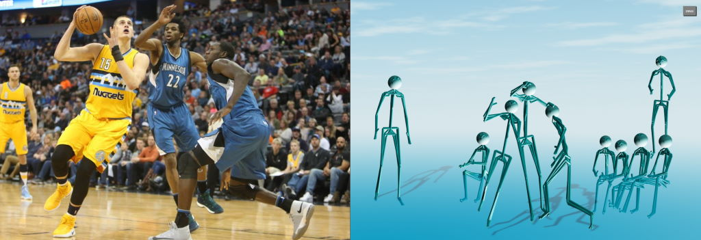
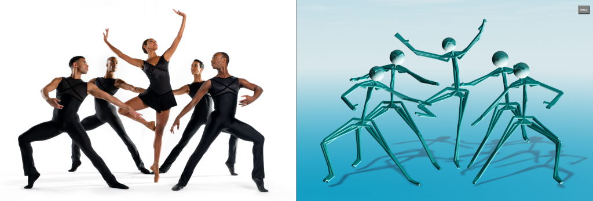

# Advanced 3D Body Pose Analysis

 

### Requirements

TensorFlow with CUDA for GPU acceleration  
Note that models used here are S.O.T.A. and computationally intensive thus requiring GPU with sufficient memory:
- [**Tiny**](https://omnomnom.vision.rwth-aachen.de/data/metrabs/metrabs_mob3l_y4t_20211019.zip) (using MobileNetV3 backbone with YOLOv4-Tiny detector) => 2GB
- [**Small**](https://omnomnom.vision.rwth-aachen.de/data/metrabs/metrabs_eff2s_y4_20211026.zip) (using EfficientNetV2 backbone with YOLOv4 detector) => 4GB (6GB recommended)
- [**Large**](https://omnomnom.vision.rwth-aachen.de/data/metrabs/metrabs_eff2l_y4_20211019.zip) (using EfficientNetV2 backbone with YOLOv4 detector) => 8GB (10GB recommended)
- [**Large 360**](https://omnomnom.vision.rwth-aachen.de/data/metrabs/metrabs_eff2l_y4_360_20211019.zip) (same as large but tuned for occluded body parts) => 8GB (12GB recommended)
## Usage

- [**Output Specs**](client/types.ts) (e.g. json format used)
- [**Constants**](client/constants.ts) (e.g., skeleton definitions with joints and connected edges)
### Process

> process.py

    arguments:
      --help                show this help message
      --image               image file
      --video               video file
      --json                write results to json file
      --round               round coordiantes in json outputs
      --minify              minify json output
      --verbose             verbose logging
      --model               model used for predictions
      --skipms              skip time between frames in miliseconds
      --plot                plot output when processing image
      --fov                 field-of-view in degrees
      --batch               process n detected people in parallel
      --maxpeople           limit processing to n people in the scene
      --skeleton            use specific skeleton definition standard
      --augmentations       how many variations of detection to run
      --average             run avarage on augmentation variations
      --suppress            suppress implausible poses
      --minconfidence       minimum detection confidence
      --iou                 iou threshold for overlaps

### Example

*Using default model and processing parameters*

> ./run.py --video media/baseball-pitch.mp4 --json baseball-pitch.json

    options: {'image': None, 'video': 'media/baseball-pitch.mp4', 'json': 'baseball-pitch.json', 'verbose': 1, 'model': 'models/metrabs_mob3l_y4t', 'skipms': 2000, 'plot': 0, 'fov': 55, 'batch': 64, 'maxpeople': -1, 'skeleton': '', 'augmentations': 5, 'average': 1, 'suppress': 1, 'minconfidence': 0.3, 'iou': 0.7}
    tensorflow 2.7.0
    cuda 11.2
    cpu devices: [PhysicalDevice(name='/physical_device:CPU:0', device_type='CPU')]
    gpu devices: [PhysicalDevice(name='/physical_device:GPU:0', device_type='GPU')]
    model loaded: models/metrabs_mob3l_y4t in 27sec
    video loaded: media/baseball-pitch.mp4 frames: 720 resolution: 1080 x 1080
    process frame: 0 timestamp: 0
    process time: 0.192sec
    ...
    video processed: 14 frames in 4.8sec
    results written to: baseball-pitch.json

 

### Visualize

> npm run dev  
<https://localhost:8001>

## ToDo

- Create process server to process data on demand
- Use animation with interpolate function instead of updating meshes
- Implement avatar animation with bones using inverse kinematics

 

## Credits

- [MeTRAbs Absolute 3D Human Pose Estimator](https://github.com/isarandi/metrabs)
